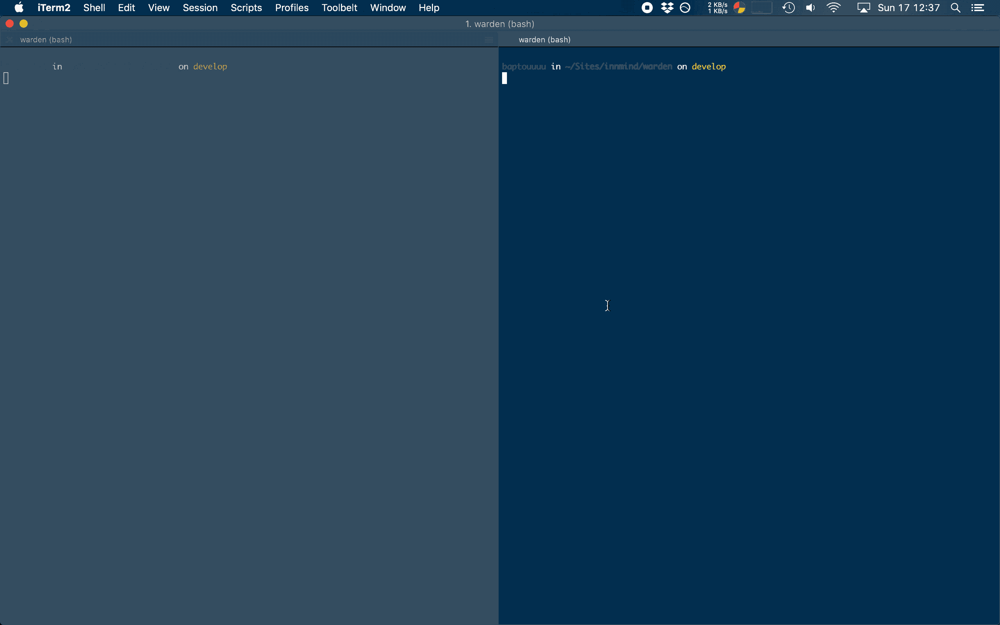

# Lab Station

[](https://github.com/Innmind/LabStation/actions?query=workflow%3ACI)
[](https://codecov.io/gh/Innmind/LabStation)
[](https://shepherd.dev/github/Innmind/LabStation)

Development tool to automate certain parts of the dev cycle.

Automatisations:
- Generating all dependecy graphs (based on the package name found in `composer.json`)
- Propose to update dependencies when starting working on the project
- Launch PHPUnit tests when `src` or `tests` folders are modified
- Launch Psalm checks (if a `psalm.xml` exists) when `src` or `tests` folders are modified
- Start docker compose when there is a `docker-compose.yml` at the project root
- Ask for the kind of tag to create when branch is changed to `master`



## Installation

```sh
composer global require innmind/lab-station
```

## Usage

In the project you want to work on (at the same level of `composer.json`):

```sh
lab-station
```

That's it, no configuration needed.
